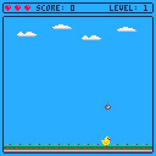
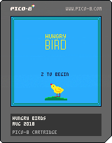

# Hungry Birdie



> A simple "catch item" game, that I made in [pico-8 by lexaloffle](https://www.lexaloffle.com/pico-8.php) fantasy console.
> The code is written in subset of lua, all assets are drawn by me.

## Todo
- [ ] Refactor it
- [ ] Add music
- [ ] More assets
- [ ] Add winning stage

## Development
The code is broken down to a few parts:

1. global constants
2. player object and movements
3. items, selecting and spawning
4. [Utils, collision](#utils)
5. cloud, swarming and moving
6. particles, for making dust
7. drawing on a screen
8. updating game

### Utils

#### Random element from list
Returns random item from listing. `flr` will convert `rnd` float (all numbers in lua are floats) value to integer and remebering, that __arrays in lua start with 1__, we need to add + 1 to result.

```lua
function any(table)
  return table[flr(rnd(#table)) + 1]
end
```

#### Pixel rounded rectangle
So I needed this function to draw rounded rectangles.
Basicly it draw rectangle and adds a pixel with background colour
to every edge of it.

```lua
function rrect(x0, y0, x1, y1, col)
  -- left, top, right, bottom
  -- & color
  rect(x0, y0, x1, y1, col)
  pset(x0, y0, bg_col)
  pset(x0, y1, bg_col)
  pset(x1, y0, bg_col)
  pset(x1, y1, bg_col)
end
```

#### Sprite rectangle
Returns coordinates of rectangle for using in collision detection function. Sprites in lua are 8px on each side, but for items in the game size is smaller and sometimes not even (5x6px), so I use width and height.

```lua
function obj_rect(obj)
  return {
    left=obj.pos.x,
    right=obj.pos.x + obj.width,
    top=obj.pos.y,
    bottom=obj.pos.y + obj.height}
end
```

#### Collision
This function I get from an [excellent book](http://www.sheepolution.com/learn/book/13) on love2d development by sheepolution. And it works quite well.

```lua
function collision(a_obj, b_obj)
  local a_rect = obj_rect(a_obj)
  local b_rect = obj_rect(b_obj)
  if
  a_rect.right > b_rect.left and
  a_rect.left < b_rect.right and
  a_rect.bottom > b_rect.top and
  a_rect.top < b_rect.bottom then
    return true
  else
    return false
  end
end
```

## Cartridge


